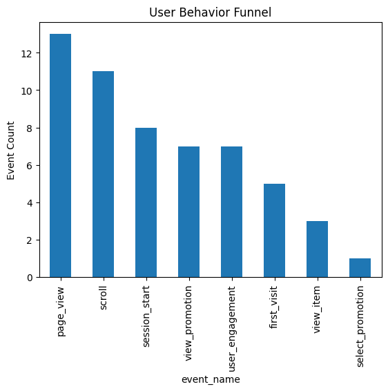
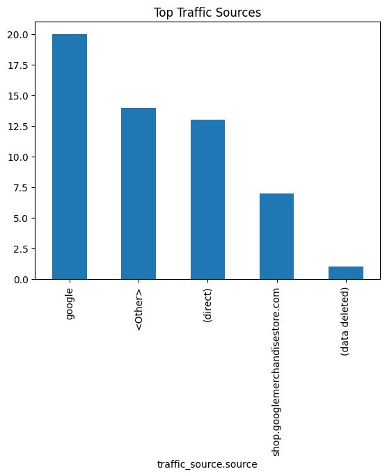
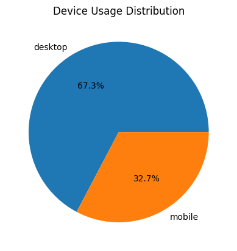
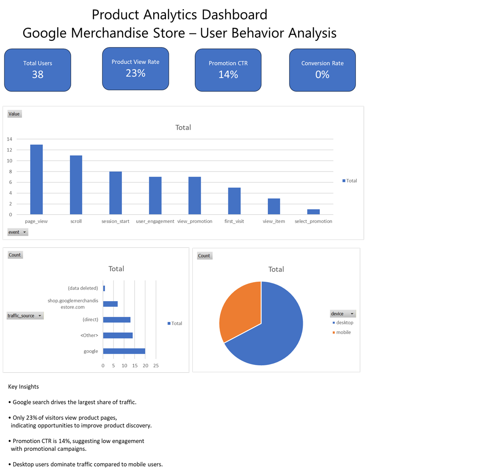

# Product User Behavior Analytics

This project analyzes user behavior data from the Google Merchandise Store using Google Analytics event data.

The goal of the project is to understand how users interact with the website and identify opportunities to improve product discovery, marketing performance, and user engagement.

---

## Dataset

The dataset is derived from Google Analytics 4 event-level data.

It includes information about:

- User sessions
- Page views
- Product views
- Promotions
- Traffic sources
- Device categories

---

## Tools Used

Python was used for the analysis along with the following libraries:

- pandas
- numpy
- matplotlib
- seaborn
- Jupyter Notebook

---

## Analysis Performed

The following analyses were conducted:

- Data cleaning and preprocessing
- User behavior funnel analysis
- Traffic source analysis
- Device usage distribution
- Conversion metrics
- Product engagement analysis

---

## Key Insights

- Google search drives the largest share of traffic.
- Only about **23% of visitors view product pages**, indicating an opportunity to improve product discovery.
- Promotion click-through rate is approximately **14%**, suggesting marketing optimization opportunities.
- Desktop users account for the majority of sessions.

---

## Visualizations

### User Behavior Funnel



### Traffic Sources



### Device Distribution



---

## Dashboard

The Excel dashboard summarizes key product analytics metrics including user funnel behavior, traffic sources, and device distribution.

Download the dashboard here: [Product Analytics Dashboard](dashboard/Product%20Analytics%20Dashboard.xlsx)

---

## Dashboard Preview



---

## Project Structure

```
product-user-behavior-analytics
│
├── README.md
├── requirements.txt
│
├── data
│   ├── raw
│   │   └── ga4_event_2021.csv
│   │
│   └── processed
│       └── clean_product_events.csv
│
├── notebooks
│   └── product_analytics.ipynb
│
├── visuals
│   ├── user_behavior_funnel.png
│   ├── traffic_sources.png
│   ├── product_analytics_dashboard.png
│   └── device_distribution.png
│
├── reports
│   └── insights_summary.md
│
└── dashboard
│   └── Product Analytics Dashboard.xlsx
```

